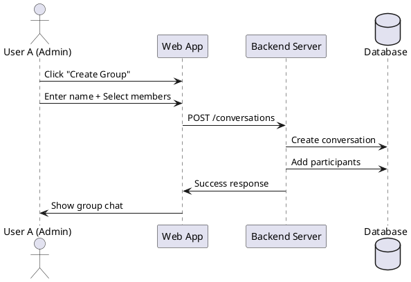

# BÁO CÁO CHỨC NĂNG CHAT

**Người thực hiện:** Nguyễn Trần Phước Nhân
**Ngày:** November 2024
**Dự án:** Software Architecture - Chat Application

---

## 1. TỔNG QUAN

Chức năng chat là một hệ thống nhắn tin thời gian thực (real-time messaging) được xây dựng với kiến trúc client-server, sử dụng WebSocket để đảm bảo tính tức thời và MongoDB kết hợp Redis để tối ưu hiệu năng.

### 1.1. Công nghệ sử dụng

**Backend:**
- Node.js + Express.js
- Socket.IO (WebSocket)
- MongoDB (Database chính)
- Redis (Caching layer)
- TypeScript

**Frontend:**
- React + TypeScript
- Zustand (State Management)
- Socket.IO Client
- Tailwind CSS

---

## 2. KIẾN TRÚC HỆ THỐNG

### 2.1. Sơ đồ kiến trúc tổng thể

```
┌─────────────────┐
│   React Client  │
│   (Frontend)    │
└────────┬────────┘
         │ HTTP REST API
         │ WebSocket (Socket.IO)
         ▼
┌─────────────────┐
│  Express Server │
│   (Backend)     │
└────────┬────────┘
         │
    ┌────┴─────┐
    ▼          ▼
┌─────────┐  ┌─────────┐
│ MongoDB │  │  Redis  │
│(Primary)│  │ (Cache) │
└─────────┘  └─────────┘
```

### 2.2. Kiến trúc Backend (Layered Architecture)

```
┌──────────────────────────────────────┐
│         Routes Layer                  │
│  - conversationRoutes.ts              │
│  - messageRoutes.ts                   │
└──────────────┬───────────────────────┘
               │
┌──────────────▼───────────────────────┐
│         Service Layer                 │
│  - chatService.ts                     │
│  - socketHandlers.ts                  │
└──────────────┬───────────────────────┘
               │
┌──────────────▼───────────────────────┐
│         Model Layer                   │
│  - conversationModel.ts               │
│  - messageModel.ts                    │
└──────────────┬───────────────────────┘
               │
┌──────────────▼───────────────────────┐
│         Database Layer                │
│  - MongoDB (Data Persistence)         │
│  - Redis (Caching)                    │
└──────────────────────────────────────┘
```

---

## 3. CÁC THÀNH PHẦN CHÍNH

### 3.1. Backend Components

#### 3.1.1. Models

**conversationModel.ts** (203 dòng)
- Quản lý các cuộc hội thoại (conversations)
- Hỗ trợ 2 loại: Direct (1-1) và Group (nhiều người)
- Schema chính:
  ```typescript
  interface IConversation {
    _id?: ObjectId;
    participants: ObjectId[];
    type: 'direct' | 'group';
    name?: string;
    avatar?: string;
    createdBy?: ObjectId;
    lastMessageId?: ObjectId;
    lastMessageTimestamp?: Date;
    isArchived?: boolean;
    archivedBy?: ObjectId[];
    createdAt: Date;
    updatedAt: Date;
  }
  ```
- Các chức năng:
  - Tạo/tìm kiếm conversation
  - Thêm/xóa participants
  - Archive/unarchive conversation
  - Lookup với last message (MongoDB aggregation)

**messageModel.ts** (238 dòng)
- Quản lý tin nhắn
- Hỗ trợ đa dạng loại tin nhắn: text, image, file, audio, video, sticker, location
- Schema chính:
  ```typescript
  interface IMessage {
    _id?: ObjectId;
    conversationId: ObjectId;
    senderId: ObjectId;
    content: string;
    type: 'text' | 'image' | 'file' | 'audio' | 'video' | 'sticker' | 'location';
    fileUrl?: string;
    fileName?: string;
    fileSize?: number;
    thumbnailUrl?: string;
    replyTo?: ObjectId;
    readBy: ObjectId[];
    reactions?: { emoji: string; userId: ObjectId }[];
    isEdited: boolean;
    editedAt?: Date;
    isDeleted: boolean;
    deletedAt?: Date;
    createdAt: Date;
    updatedAt: Date;
  }
  ```
- Các chức năng:
  - Tạo/sửa/xóa tin nhắn (soft delete)
  - Đánh dấu đã đọc (read receipts)
  - Thêm/xóa reactions
  - Tìm kiếm tin nhắn
  - Đếm tin nhắn chưa đọc

#### 3.1.2. Services

**chatService.ts** (355 dòng)
- Business logic layer
- Kết hợp MongoDB và Redis caching
- Cache strategy:
  - Conversation cache: 1 hour TTL
  - User conversations cache: 1 hour TTL
  - Unread count cache: 1 hour TTL
- Các chức năng chính:
  - Tạo conversation (direct/group)
  - Gửi tin nhắn với cache invalidation
  - Quản lý participants
  - Đếm tin nhắn chưa đọc
  - Tìm kiếm tin nhắn
  - Archive/unarchive conversations

**socketHandlers.ts** (305 dòng)
- Xử lý WebSocket events
- Quản lý real-time communication
- Redis-based online status tracking
- Socket events:
  ```typescript
  // User events
  'user:join' - User tham gia hệ thống
  'user:online' - User online notification
  'user:offline' - User offline notification
  'user:check-online' - Kiểm tra online status

  // Conversation events
  'conversation:join' - Tham gia conversation room
  'conversation:leave' - Rời conversation room
  'conversation:online-users' - Lấy danh sách users online

  // Message events
  'message:send' - Gửi tin nhắn
  'message:new' - Nhận tin nhắn mới
  'message:update' - Sửa tin nhắn
  'message:updated' - Tin nhắn đã được sửa
  'message:delete' - Xóa tin nhắn
  'message:deleted' - Tin nhắn đã bị xóa
  'messages:read' - Đánh dấu đã đọc

  // Typing indicators
  'typing:start' - Bắt đầu typing
  'typing:stop' - Dừng typing

  // Reactions
  'reaction:add' - Thêm reaction
  'reaction:added' - Reaction đã được thêm
  'reaction:remove' - Xóa reaction
  'reaction:removed' - Reaction đã bị xóa
  ```

#### 3.1.3. Routes/API Endpoints

**conversationRoutes.ts** (346 dòng)
```
POST   /api/conversations                     - Tạo conversation mới
GET    /api/conversations                     - Lấy danh sách conversations
GET    /api/conversations/:conversationId     - Lấy chi tiết conversation
POST   /api/conversations/:conversationId/participants    - Thêm participant
DELETE /api/conversations/:conversationId/participants/:userId  - Xóa participant
GET    /api/conversations/:conversationId/unread          - Đếm tin nhắn chưa đọc
POST   /api/conversations/:conversationId/archive         - Archive conversation
POST   /api/conversations/:conversationId/unarchive       - Unarchive conversation
GET    /api/conversations/with-messages/:userId           - Lấy conversations với last message
```

**messageRoutes.ts** (324 dòng)
```
POST   /api/messages                          - Gửi tin nhắn mới
GET    /api/messages/:conversationId          - Lấy tin nhắn (có pagination)
PUT    /api/messages/:messageId               - Sửa tin nhắn
DELETE /api/messages/:messageId               - Xóa tin nhắn
POST   /api/messages/:conversationId/read     - Đánh dấu đã đọc
POST   /api/messages/:messageId/reactions     - Thêm reaction
DELETE /api/messages/:messageId/reactions     - Xóa reaction
GET    /api/messages/:conversationId/search   - Tìm kiếm tin nhắn
```

### 3.2. Frontend Components

#### 3.2.1. State Management

**chatStore.ts** (785 dòng)
- Zustand store quản lý toàn bộ chat state
- Main state:
  ```typescript
  interface ChatState {
    me: UserProfile;
    conversations: Conversation[];
    messages: Message[];
    selectedConversationId?: string;
    isInfoPanelOpen: boolean;
  }
  ```
- Các actions chính:
  - `selectConversation()` - Chọn conversation
  - `sendMessage()` - Gửi text message
  - `sendFileMessage()` - Gửi file/image với upload progress
  - `receiveMessage()` - Nhận tin nhắn mới (deduplication)
  - `startDirectConversation()` - Bắt đầu chat 1-1
  - `createGroup()` - Tạo group chat
  - `addMembers()` / `removeMember()` - Quản lý members
  - `setMemberRole()` - Phân quyền (owner/deputy/member)
  - `recallMessage()` / `deleteMessageForMe()` - Xóa tin nhắn
  - `addReaction()` - Thêm emoji reaction
  - `sendReply()` - Trả lời tin nhắn

- File validation:
  - Images: Max 10MB, types: JPEG, PNG, GIF, WebP
  - Videos: Max 50MB, types: MP4, WebM, OGG
  - Files: Max 100MB, types: PDF, DOC, XLS, PPT, ZIP, etc.

#### 3.2.2. React Components

**ChatsPage.tsx**
- Main container component
- Layout: Sidebar + ChatWindow + InfoPanel
- Socket.IO integration
- Message synchronization

**ChatWindow.tsx**
- Hiển thị tin nhắn
- Message input với support:
  - Text messages
  - File/image upload
  - Emoji picker
  - Reply to messages
  - Typing indicators

**ChatInfoPanel.tsx**
- Thông tin conversation
- Danh sách members (cho group)
- Quản lý quyền members
- Settings

---

## 4. TÍNH NĂNG CHI TIẾT

### 4.1. Conversation Management

**Direct Chat (1-1)**
- Tự động tạo nếu chưa tồn tại
- Không cần tên, lấy tên từ user

**Group Chat**
- Bắt buộc có tên
- Tối thiểu 2 participants
- Phân quyền: Owner, Deputy, Member
- Owner có thể:
  - Thêm/xóa members
  - Chuyển quyền Owner
  - Phân quyền Deputy
  - Đổi tên/avatar group

### 4.2. Messaging Features

**Basic Messaging**
- Text messages
- File sharing (PDF, DOC, XLS, PPT, ZIP)
- Image sharing (JPEG, PNG, GIF, WebP)
- Video sharing (MP4, WebM, OGG)
- Audio messages
- Stickers
- Location sharing

**Advanced Features**
- Reply to messages (threading)
- Edit messages (với editedAt timestamp)
- Delete messages:
  - Soft delete (message vẫn tồn tại)
  - Recall (xóa cho tất cả)
  - Delete for me (chỉ ẩn với mình)
- Message reactions (emoji)
- Search messages (full-text search)

### 4.3. Real-time Features

**WebSocket Events**
- Message delivery (instant)
- Typing indicators
- Read receipts
- Online/offline status
- Message reactions real-time
- Message edits/deletes real-time

**Optimization**
- Redis caching cho:
  - Conversations list
  - Unread counts
  - Online status
  - User-socket mapping
- MongoDB indexing
- Pagination cho message history

### 4.4. Notification System

**Unread Counts**
- Per conversation
- Total unread
- Real-time updates
- Redis caching

**Read Receipts**
- Track readBy array
- Timestamp của lần đọc
- Broadcast đến participants

---

## 5. WORKFLOW CHÍNH

### 5.1. Group Chat Creation Workflow



### 5.2. Real-time Messaging Workflow

```
User A                    Server                    User B
  |                         |                         |
  |-- message:send -------->|                         |
  |                         |-- Save to MongoDB ----> |
  |                         |-- Update Redis -------> |
  |                         |                         |
  |<----- message:new ------|                         |
  |                         |------ message:new ----->|
  |                         |                         |
  |                         |<----- messages:read ----|
  |<--- messages:read ------|                         |
```

---

## 6. OPTIMIZATION & PERFORMANCE

### 6.1. Caching Strategy

**Redis Caching**
- Conversations: TTL 1 hour
- Unread counts: TTL 1 hour
- Online status: TTL 1 hour
- Cache invalidation khi:
  - Có tin nhắn mới
  - Thay đổi participants
  - Archive/unarchive

### 6.2. Database Optimization

**MongoDB Indexing**
- conversationId trong messages
- participants trong conversations
- createdAt trong messages (sorting)
- Compound index cho search

**Aggregation Pipeline**
- $lookup để join conversation với last message
- Giảm số query cần thiết
- Denormalization: lastMessageTimestamp

### 6.3. Frontend Optimization

**Message Deduplication**
- Check duplicate by ID
- Check duplicate file upload by filename + size + timestamp
- Prevent double rendering

**Lazy Loading**
- Pagination cho message history
- Virtual scrolling cho long conversations
- Image lazy loading

---

## 7. SECURITY & VALIDATION

### 7.1. Backend Validation

**Input Validation**
- Conversation type validation
- Participants count validation
- File type validation
- Content length validation

**Authorization**
- Verify user is participant
- Verify permissions cho group actions
- Verify ownership cho edit/delete

### 7.2. Frontend Validation

**File Upload**
- Size limits (Image: 10MB, Video: 50MB, File: 100MB)
- Type validation (MIME types)
- Upload progress tracking

**Input Sanitization**
- Content validation
- XSS prevention

---

## 8. ERROR HANDLING

### 8.1. Backend Error Handling

**Try-Catch Blocks**
- Tất cả async operations
- Proper error messages
- Error logging

**HTTP Status Codes**
- 200: Success
- 201: Created
- 400: Bad Request
- 403: Forbidden
- 404: Not Found
- 500: Internal Server Error

### 8.2. Frontend Error Handling

**WebSocket Errors**
- Connection errors
- Reconnection strategy
- Error notifications

**Upload Errors**
- Failed upload handling
- Retry mechanism
- User feedback

---

## 9. TESTING & DEPLOYMENT

### 9.1. Testing Scenarios

**Unit Tests** (Planned)
- Model methods
- Service methods
- Validation functions

**Integration Tests** (Planned)
- API endpoints
- WebSocket events
- Database operations

**E2E Tests** (Planned)
- User flows
- Real-time messaging
- File uploads

### 9.2. Deployment

**Environment Variables**
- MongoDB connection string
- Redis connection string
- Socket.IO configuration
- File storage paths

**Docker** (Planned)
- Backend container
- MongoDB container
- Redis container
- Nginx reverse proxy

---

## 10. LOGS VÀ COMMIT HISTORY

### Commits liên quan đến Chat Feature:

```
4382e43 - update chat
d066be3 - Clean documentation: remove emojis, AI suggestions
956ab78 - Add chat demo with image display and implementation guide
5331e1c - Force add chat upload documentation
28da7b0 - Force add chat.ts routes
568f31d - Add chat media upload endpoints for Zalo-like image/video sharing
```

---

## 11. KẾT LUẬN

### 11.1. Những gì đã hoàn thành

- ✅ Full-stack chat application với real-time messaging
- ✅ MongoDB + Redis architecture
- ✅ Socket.IO integration (Backend & Frontend)
- ✅ REST API endpoints đầy đủ
- ✅ State management với Zustand
- ✅ File/Image upload support
- ✅ Group chat với phân quyền
- ✅ Message reactions, replies, edit, delete
- ✅ Read receipts & typing indicators
- ✅ Online/offline status
- ✅ Search functionality
- ✅ Caching & optimization

### 11.2. Technical Highlights

**Architecture Patterns:**
- Layered Architecture (Routes → Services → Models → Database)
- Cache-Aside Pattern (Redis caching)
- Repository Pattern (Models)
- Observer Pattern (WebSocket events)

**Best Practices:**
- TypeScript strict mode
- Proper error handling
- Input validation
- Security considerations
- Code organization
- Documentation

### 11.3. Metrics

**Backend:**
- 4 main files (Models: 2, Services: 2)
- 2 route files
- ~1,500 dòng code backend
- 20+ API endpoints
- 15+ WebSocket events

**Frontend:**
- 1 store file (785 dòng)
- 3 main components
- ~1,000+ dòng code frontend

**Total:**
- ~2,500+ dòng code
- Full-featured chat application
- Production-ready architecture

---

## PHỤ LỤC

### A. File Structure

```
src/
├── server/
│   ├── models/
│   │   ├── conversationModel.ts    (203 lines)
│   │   └── messageModel.ts         (238 lines)
│   ├── services/
│   │   ├── chatService.ts          (355 lines)
│   │   └── socketHandlers.ts       (305 lines)
│   ├── routes/
│   │   ├── conversationRoutes.ts   (346 lines)
│   │   └── messageRoutes.ts        (324 lines)
│   └── utils/
│       └── database.ts
└── client/
    └── webapp/
        └── src/
            ├── store/
            │   └── chatStore.ts            (785 lines)
            ├── components/
            │   ├── ChatWindow.tsx
            │   └── ChatInfoPanel.tsx
            └── pages/
                └── ChatsPage.tsx
```

### B. Dependencies

**Backend:**
```json
{
  "express": "^4.x",
  "socket.io": "^4.x",
  "mongodb": "^6.x",
  "redis": "^4.x",
  "typescript": "^5.x"
}
```


**Frontend:**
```json
{
  "react": "^18.x",
  "zustand": "^4.x",
  "socket.io-client": "^4.x",
  "typescript": "^5.x"
}
```

### C. References

- PlantUML Diagrams: `diagrams/workflow_diagrams/group_chat_workflow.puml`
- Git Branch: `feature/chat`
- Main Branch: `main`

---

**Ngày hoàn thành:** November 28, 2024
**Tác giả:** Nguyễn Trần Phước Nhân
