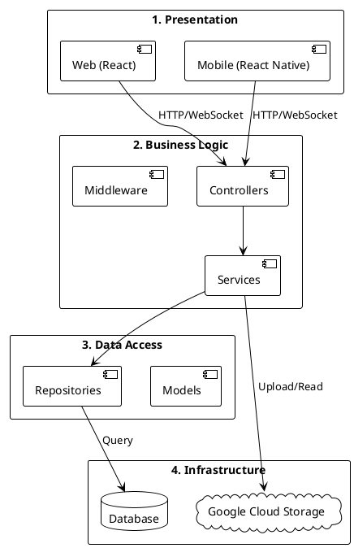
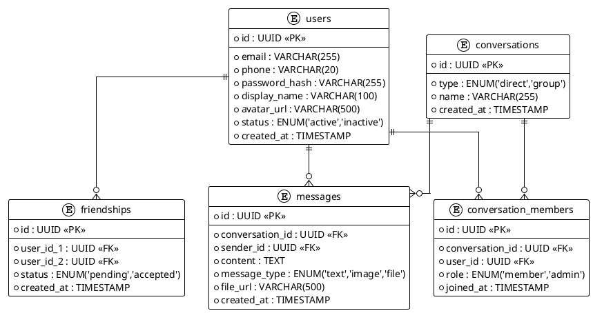
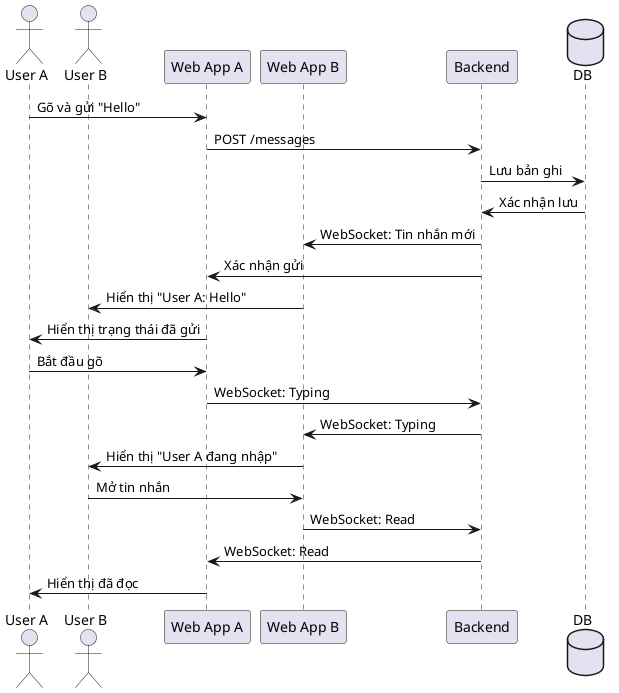

# Báo cáo Bài tập: Phân tích yêu cầu, Thiết kế hệ thống và Triển khai Google Cloud

## 1. Phân tích yêu cầu

### 1.1 Yêu cầu chức năng
Hệ thống nhắn tin OTT (tương tự Zalo) bao gồm các chức năng chính sau:
- Đăng ký, xác thực tài khoản, đăng nhập, đăng xuất.
- Quản lý hồ sơ người dùng, tìm kiếm người dùng.
- Quản lý danh bạ: gửi lời mời kết bạn, chấp nhận/từ chối, hủy kết bạn, xem danh bạ.
- Nhắn tin 1-1 và nhóm: gửi/nhận văn bản, hình ảnh, video ngắn, tài liệu.
- Xem lịch sử trò chuyện, hiển thị danh sách cuộc trò chuyện.
- Chỉ báo thời gian thực: đang nhập, xác nhận đã đọc.
- Thống kê cơ bản cho người dùng và tổng quan cho quản trị viên.

### 1.2 Yêu cầu phi chức năng
- Hiệu năng: độ trễ hiển thị tin nhắn dưới 2 giây trong điều kiện mạng ổn định; UI phản hồi mượt mà.
- Tính khả dụng: giao diện trực quan, nhất quán giữa web và mobile.
- Độ tin cậy: hệ thống ổn định, đảm bảo toàn vẹn dữ liệu, không mất tin nhắn.
- Bảo mật: mật khẩu băm an toàn; yêu cầu xác thực cho truy cập tài nguyên người dùng.
- Khả năng bảo trì: mã nguồn rõ ràng, cấu trúc module, tuân thủ quy ước đặt tên.
- Khả năng mở rộng: kiến trúc module hóa, tương thích triển khai trên Cloud.

## 2. Thiết kế hệ thống

### 2.1 Loại kiến trúc phần mềm sử dụng
Áp dụng kiến trúc phân lớp (Layered Architecture) kết hợp mẫu MVC:
- Lớp trình bày (Presentation): giao diện web React và mobile React Native.
- Lớp nghiệp vụ (Business Logic): controller, service, middleware (xác thực, kiểm tra dữ liệu).
- Lớp truy cập dữ liệu (Data Access): model, repository, DAO.
- Lớp hạ tầng (Infrastructure): cơ sở dữ liệu, lưu trữ tệp, máy chủ WebSocket.

Lý do lựa chọn: phân tách trách nhiệm rõ ràng, dễ bảo trì, phù hợp bài tập học thuật, hỗ trợ mở rộng từng lớp và di chuyển dần sang microservices.

### 2.2 Design decisions (quyết định thiết kế)
- Phân lớp rõ ràng để giảm kết nối chặt (loose coupling) và tăng khả năng thay thế từng thành phần.
- Sử dụng WebSocket (Socket.IO) cho tính năng thời gian thực: gửi tin nhắn, trạng thái đang nhập, xác nhận đã đọc.
- Dữ liệu tin nhắn ưu tiên lưu dạng ghi nhanh; có thể sử dụng PostgreSQL cho người dùng và MongoDB cho tin nhắn (tùy yêu cầu nhóm), trừu tượng qua repository.
- Lưu trữ tệp đa phương tiện trên Google Cloud Storage, trả về URL công khai sau khi tải lên.
- Triển khai API bằng Node.js/Express + TypeScript, middleware xác thực tập trung ở lớp nghiệp vụ.
- Tách frontend khỏi backend, giao tiếp qua REST và WebSocket; sử dụng `express.static` để phục vụ trang thử nghiệm cùng nguồn (tránh CORS).

### 2.3 UML/PlantUML

#### 2.3.1 Kiến trúc phân lớp (Layered Architecture)


#### 2.3.2 Bối cảnh hệ thống (System Context)
```plantuml
@startuml system_context
!theme plain
skinparam componentStyle rectangle

actor "User (Web)" as UserWeb
actor "User (Mobile)" as UserMobile
actor "Admin" as Admin

rectangle "Zalo Clone App" as App {}
cloud "Email Service" as Email
cloud "Google Cloud Storage" as Storage

UserWeb --> App : Đăng nhập, Nhắn tin, Quản lý danh bạ
UserMobile --> App : Đăng nhập, Nhắn tin, Quản lý danh bạ
Admin --> App : Thống kê, Quản trị
App --> Email : Gửi email xác thực
App --> Storage : Lưu trữ/Truy xuất hình ảnh, tệp

@enduml
```

#### 2.3.3 Thiết kế cơ sở dữ liệu (Entity Relationship)


#### 2.3.4 Luồng thời gian thực (Runtime Messaging)


## 3. Google Cloud Platform

### 3.1 Tài nguyên và cấu hình
- Dự án GCP: `zola-478416`, vùng `asia-southeast1` (độ trễ thấp với Việt Nam).
- Máy ảo Compute Engine: `zola-server` (Ubuntu 22.04, e2-micro); mở cổng 5000.
- Cloud Storage: bucket `zola-uploads-2470576` lưu hình ảnh, video; quyền đọc công khai đối tượng.
- Tài khoản dịch vụ: `zola-backend` có vai trò Storage Admin; tệp khóa JSON lưu an toàn trên máy chủ, không đưa vào Git.

### 3.2 Triển khai và vận hành
- Backend Node.js/Express (TypeScript), quản lý tiến trình bằng PM2 (khởi động cùng hệ thống, tự khởi động lại khi lỗi).
- Phục vụ trang thử nghiệm qua `express.static('public')` để cùng nguồn với API, tránh CORS.
- Endpoint tải lên:
  - `POST /api/chat/image`: ảnh đơn, giới hạn 10 MB.
  - `POST /api/chat/images`: nhiều ảnh (tối đa 10), mỗi tệp 10 MB.
  - `POST /api/chat/video`: video ngắn, giới hạn 10 MB.
  - `GET /api/chat/info`: mô tả API.
- Quy trình lưu trữ: Multer nhận multipart/form-data, stream lên GCS, tạo URL công khai trả về client.

### 3.3 Lý do lựa chọn và đánh giá
- Khả dụng và chi phí: e2-micro thuộc lớp miễn phí; phù hợp mục tiêu bài tập.
- Mở rộng: tách lớp hạ tầng; có thể mở rộng sang GKE, CDN, cache khi cần.
- Bảo mật: khóa dịch vụ bảo vệ qua `.gitignore`, phân quyền IAM tối thiểu; khuyến nghị thêm xác thực JWT và giới hạn tốc độ ở môi trường sản xuất.
